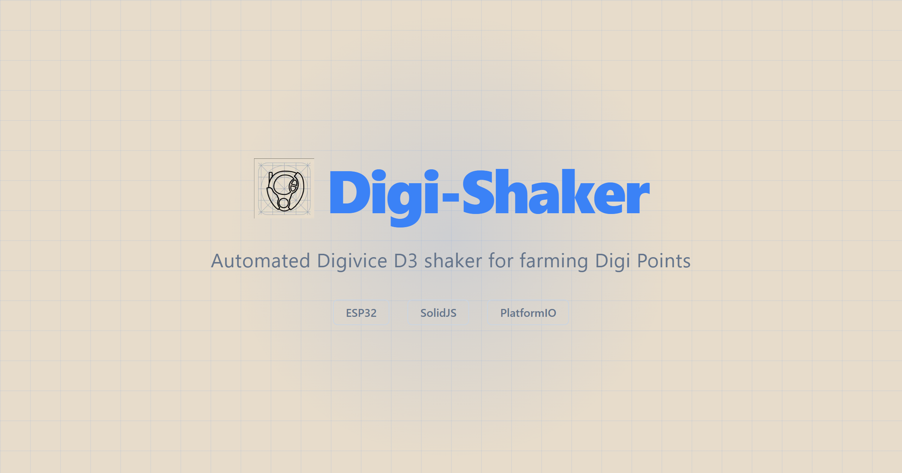
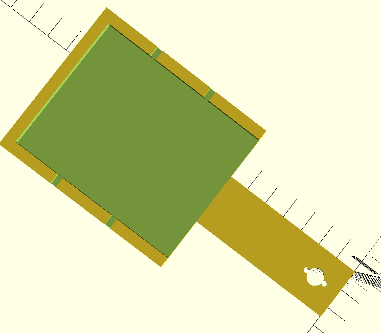
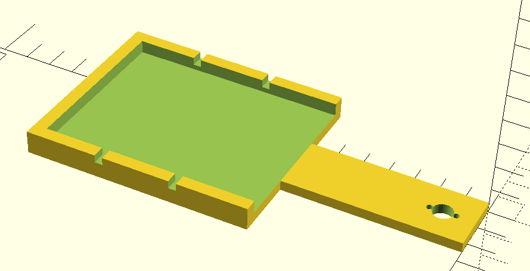

<p align="center">
  
</p>

<p align="center">
  <strong>Automated Digivice D3 shaker for farming Digi Points — controlled via web dashboard.</strong>
</p>

<p align="center">
  <a href="LICENSE"></a>
</p>

---

An ESP32-powered physical device that shakes a Digivice D3 (Version 3 Japan edition) to farm Digi Points. Part of a larger reverse engineering project for the D3 game.

Features a 3D printed arm that holds the device, driven by an MG996R servo. Control via web dashboard with configurable shake patterns, calibration, and step tracking.


Configure shake patterns, frequency, duration and rest periods from the web dashboard.


Step counting for accurate Digi Point tracking.

## Hardware

- **ESP32** (NodeMCU CH340 USB-C)
- **MG996R servo** driven by 3D printed arm cradle (in `models/`)




<details>
<summary>3D printed parts</summary>

- Servo arm cradle (designed for MG996R)
- Device holder/clip
- Mounting base

Models in `models/` — designed for FDM printing with PLA.

</details>

## Quick Start

### 1. Flash the firmware

```bash
cd firmware
pio run upload
```

Configure WiFi credentials in `firmware/include/wifi_credentials.h` before building.

### 2. Run the dashboard

```bash
cd dashboard/ui
bun install
bun dev
```

Open http://localhost:5173 — the dashboard auto-discovers the device via mDNS or connect directly to `http://<device-ip>:81`.

### 3. Configure and start shaking

Set shake frequency, amplitude, and duration from the dashboard. The device will shake in cycles with rest periods.

## WebSocket Protocol

The dashboard communicates with the device over WebSocket on port 81.

```
┌──────────────┐    WS :81    ┌─────────────┐
│  Dashboard  │ ◀───────────▶ │ ESP32       │
│  (SolidJS)  │              │ + Servo     │
└──────────────┘              └─────────────┘
```

Messages are JSON — see `openspec/changes/remote-dashboard/specs/websocket-protocol/spec.md` for the full protocol spec.

## Architecture

```
┌─────────────────────────────────────────────────────────────┐
│                      Web Dashboard                         │
│  ┌─────────────┐  ┌──────────────┐  ┌─────────────────┐  │
│  │ StatusPanel │  │ ControlPanel │  │ CalibrationView  │  │
│  └─────────────┘  └──────────────┘  └─────────────────┘  │
└────────────────────────────┬────────────────────────────────┘
                             │ WebSocket
                             ▼
┌─────────────────────────────────────────────────────────────┐
│                         ESP32                               │
│  ┌──────────────┐  ┌───────────────┐  ┌────────────────┐  │
│  │ StateMachine │  │ ServoControl  │  │ StepCounter    │  │
│  │ IDLE/SHAKING │  │ MG996R driver │  │ Zero-crossing  │  │
│  └──────────────┘  └───────────────┘  └────────────────┘  │
│         │                  │                  │            │
│         └──────────────────┼──────────────────┘            │
│                            ▼                               │
│                    ┌─────────────┐                         │
│                    │   Servo     │ ◀── shakes D3 device    │
│                    └─────────────┘                         │
└─────────────────────────────────────────────────────────────┘
```

## Tech Stack

- **ESP32** — microcontroller
- **PlatformIO** — firmware build
- **Arduino** — firmware framework
- **SolidJS** — dashboard UI
- **WebSockets** — real-time control
- **OpenSCAD** — 3D models

## Development

```bash
# Firmware
cd firmware
pio run upload
pio monitor

# Dashboard
cd dashboard/ui
bun dev
```

## License

MIT
